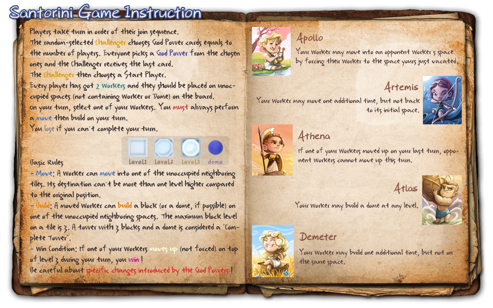
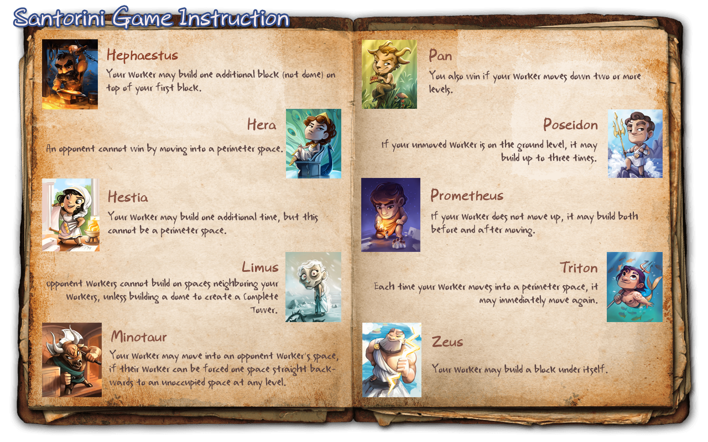

# Final Project - Software Engineering 2019/2020


## Introduction
The Final Project of Software Engineering course (Politecnico di Milano, 2019/2020)
consists in the implementation of **Santorini**, a strategy board game.  
The distributed system includes a server and multiple clients which can join one match at a time.

* Game description  
  Play as a Greek God or Goddess!  
  You should compete to best aid the island's citizens in building a beautiful village in the middle of the Aegean Sea.  
  The game is designed by Gord Hamilton and published by Roxley Games.  
  More information about Santorini: [Click here](https://roxley.com/products/santorini)

* Game rules

<p align="center">

</p>

<p align="center">

</p>


## Group GC44
- Feng Yang ([@fengyang98](https://github.com/fengyang98))
- Zheng Maria Yu ([@Trixyz28](https://github.com/Trixyz28))
- Linda Zhu ([@lnd24](https://github.com/lnd24))


## Features
| Requirements | State |
|:-----------------------|:------------------------------------:|
| Complete Rules | [](#) |
| Socket | [](#) |
| CLI | [](#) |
| GUI | [](#) |
| Multiple matches  | [](#) |
| Advanced Gods | [](#) |
| Persistence | [](#) |
| Undo | [](#) |

* Complete Rules  
  All Simple Gods implemented (except Hermes).  
  n° players supported in a match: 2-3.
 
* Multiple matches  
  The server can handle more matches in the same time.
  
* Advanced Gods  
  5 Advanced Gods implemented: Hera, Hestia, Limus, Poseidon, Zeus.


## System Requirements
This application requires Java 14 to run.  
To visualize the client CLI correctly, the chosen terminal should support UTF-8 characters.  
Recommended screen resolution: 1920x1080 or higher.


## How to create executable files
Server.jar and Client.jar can be created with Maven Shade Plugin, through the command
```sh
mvn clean package
```

## How to run the application
  
### Server
```sh
java -jar Server.jar [port]
```
If there is no port number specified, the server will automatically use the default one (45000).

### Client
Double-click on Client.jar will launch the GUI.
As an alternative, it is possible running the client through
```sh
java -jar Client.jar [parameter]
```
If the parameter is null, the GUI will be launched. Otherwise, it will active the CLI.


## Tested environments
* Windows: Win10 (Windows Terminal, WSL)
* Linux: VM Ubuntu 20.04
* MacOS: VM Mojave 10.14


## Test Coverage


## Tools
* Java 14
* Maven
* JavaFX
* JUnit


